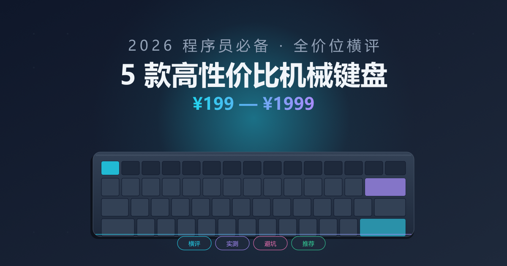

# 2026 年程序员必看！5 款高性价比机械键盘横评，从 199 到 1999 全价位

> 本文不是参数表堆砌，是我**自己掏钱买回来、每天敲 8 小时**的真实体验。每一款都有结论：值不值得买、适合谁、不适合谁。

<!--  -->

作为一名写了 8 年代码的老程序员，我对键盘的执念大概从第一把 Cherry 3000 开始。算上给同事推荐、帮朋友代购，前前后后用过 12 把机械键盘，踩过 4 次退货的坑（手感不对、退格卡顿、蓝牙断连、键帽打油）。

今年趁着给新工作室置办装备，把市面上口碑不错的几款全买回来对比了一轮，留下 5 款**真正值得买**的——从学生党 199 元入门，到桌面党的 1999 元旗舰，覆盖完整价位段。

## 选购之前：3 个一定要想清楚的点

在翻任何测评之前，先回答自己三个问题：

1. **你主要在哪用？** —— 桌面固定位、有线优先；出差通勤、三模（有线 + 蓝牙 + 2.4G）才实用。
2. **你喜欢什么手感？** —— 线性轴（红轴）直上直下安静；段落轴（青轴）有节奏但吵；茶轴居中。
3. **配列你能接受吗？** —— 104 全键盘 / 87 紧凑 / 75% / 60%。程序员的 F 区、方向键很重要，建议至少 87 键。

## 横评 5 款清单

下面这 5 款我都用了**至少两周以上**，评价基于 8 小时编程场景的真实敲击感受。

### ① RK C87 —— 199 元的"卷王"入门款

**到手价：199 元 | 87 键 | 单模有线 | G 结构**

去年这价位只能买薄膜，今年 RK 把客制化级别的 Gasket 结构下放到了 199 段位。**红轴版本**敲起来有"软弹"感，比同价位的卫星轴键盘明显安静。

- ✅ **优点**：Gasket 结构带来的软弹手感；大键出厂润得不错；键帽是 PBT 不易打油
- ❌ **缺点**：只有单模有线；驱动软件略简陋；灯光是"有但没必要"
- 🎯 **适合人群**：学生党、第一次入坑机械键盘、桌面固定位

> **一句话总结**：199 元这个价位，没有比它更能打的。

### ② 达尔优 A87 Pro —— 339 元的"水桶机"

**到手价：339 元 | 87 键 | 三模 | Gasket + 硅胶夹心**

如果说 RK 是入门守门员，达尔优 A87 Pro 就是**300 元段位的水桶机**。三模连接（有线 / 蓝牙 / 2.4G）、Gasket 结构、客制化级热插拔轴座全都给到。

- ✅ **优点**：三模齐全；热插拔轴座可以自己换轴；电池续航标称 240 小时（实测能用一个月）
- ❌ **缺点**：默认键帽是 ABS，长时间用会打油（建议另购一套 PBT）；配套驱动功能不算丰富
- 🎯 **适合人群**：想一步到位、有多设备切换需求（笔记本 + 台式机）

> **一句话总结**：339 元没有明显短板，是"不知道买什么就买它"的安全牌。

### ③ 高斯 HS98T —— 449 元的"复古颜值党"

**到手价：449 元 | 98 键 | 三模 | 复古工业设计**

98 配列这两年突然火了——比 104 少了右侧数字区小键盘，又比 87 多了数字键。**程序员用数字键调试**、**会计用数字键录数据**，这种配列是它们的甜点。

高斯 HS98T 的复古工业设计我特别喜欢：银色金属面板 + 圆形键帽 + 双色注塑 PBT 键帽，摆桌面上辨识度拉满。

- ✅ **优点**：98 配列兼顾 F 区与数字键；复古设计颜值高；TTC 金粉轴 V2 手感细腻
- ❌ **缺点**：价格偏高；驱动只能在有线模式下用；圆形键帽初次上手需要适应
- 🎯 **适合人群**：颜值党、需要数字键但桌面空间有限的开发者

> **一句话总结**：买它是买设计 + 手感，参数党慎入。

### ④ 珂芝 K75 Pro —— 599 元的"客制化平替"

**到手价：599 元 | 75 键 | 三模 | Gasket + 全键热插拔**

如果你眼馋客制化键盘（5000+ 价位那种），但钱包不允许，**珂芝 K75 Pro 是 2026 年最接近客制化体验的量产键盘**。

- 全键热插拔轴座：随便换轴玩
- Gasket 结构 + FR4 定位板：敲击音"咚咚"很脆

我给它换了一套**凯华 BOX 白轴 V2**（提前段落，类似青轴但更脆），写代码的反馈感一下子上了一个台阶。

- ✅ **优点**：客制化级别配置；VIA 改键生态成熟；75% 配列紧凑又够用
- ❌ **缺点**：默认轴一般（建议另购好轴换上）；键帽是 ABS（必换 PBT）
- 🎯 **适合人群**：想"玩"键盘、研究客制化的进阶玩家

> **一句话总结**：买回来**默认体验及格，换轴换键帽之后惊喜**。

### ⑤ IQUNIX OG80 —— 1999 元的"无线旗舰"

**到手价：1999 元 | 80 键 | 三模 | 铝合金 CNC 外壳**

最后一款是给预算充足的朋友准备的。IQUNIX OG80 是我个人桌面目前的"日用键盘"，用了半年。

**为什么这么贵？**

- 整块铝合金 CNC 一体外壳，重 2.1kg，敲击稳如老狗
- 客制化级润轴 + 厂润卫星轴（不用自己再润）
- TTC 金粉轴 V2 / 快银轴可选
- 三模 + 蓝牙可连 3 台设备 + 2.4G + 有线

它不是最贵的（2000 元级别有 HHKB、Filco 等老牌），但**综合设计 + 手感 + 颜值 + 价格**，是我心里的 T0 级。

- ✅ **优点**：铝合金外壳质感顶级；出厂手感就是客制化水平；颜值超高（绿、白、黑三色）
- ❌ **缺点**：重（2.1kg 不便携）；价格门槛高；驱动在 Mac 上偶尔抽风
- 🎯 **适合人群**：桌面党、预算充足、追求"一步到位"

> **一句话总结**：贵不是它的缺点，是我的缺点。

## 总览对比表

| 型号 | 价格 | 配列 | 连接 | 亮点 | 适合人群 |
|------|------|------|------|------|----------|
| RK C87 | ¥199 | 87 | 有线 | Gasket + 199 价位 | 学生党 / 入门 |
| 达尔优 A87 Pro | ¥339 | 87 | 三模 | 水桶机 | 不知道买啥就买它 |
## 我的个人推荐

> 如果只能选一把，我会推荐 **达尔优 A87 Pro**。

理由：

1. **三模** 解决"笔记本 + 台式机"切换问题（远程办公党的刚需）
2. **Gasket + 热插拔** 给了后期换轴的玩法空间
3. **价格** 不至于让你"用两天就后悔"

如果你预算再加 250，**珂芝 K75 Pro** 是更"折腾但更爽"的选择。

预算够就直接 **IQUNIX OG80**，省心。

## 写在最后

机械键盘这个品类，**没有"最好"，只有"最适合"**。本文列出的 5 款是我用过、也愿意继续用的；至于没上榜的型号（比如有些被吹得很神的型号），要么手感不值那个价，要么稳定性有坑，这里就不点名了。
---
